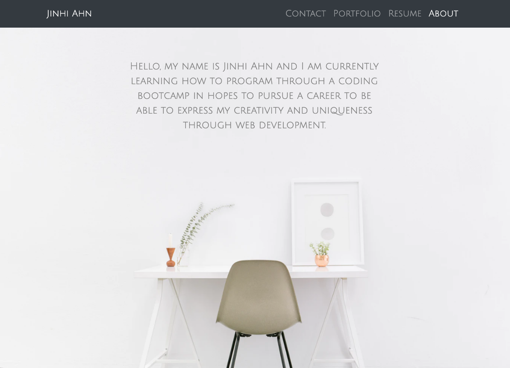

# Unit 02 CSS and Bootstrap Homework: Responsive Portfolio

## Project Info

This project was designed to create a responsive portfolio website utilizing Bootstrap. 

### Motivation

This is the beginning creation of my personal website that will be used to plan, organize, and showcase a collection of successfully completed projects that will illustrate my skills and abilities to potential career opportunites. 

### Installation

* Semantic markup used for simple referencing
* Bootstrap's grid system implemented
* Navbar and sticky footer added for easy navigation

### Resources 

* Bootstrap.com
* W3schools.com
* Unsplash.com 
* Stackoverflow.com
